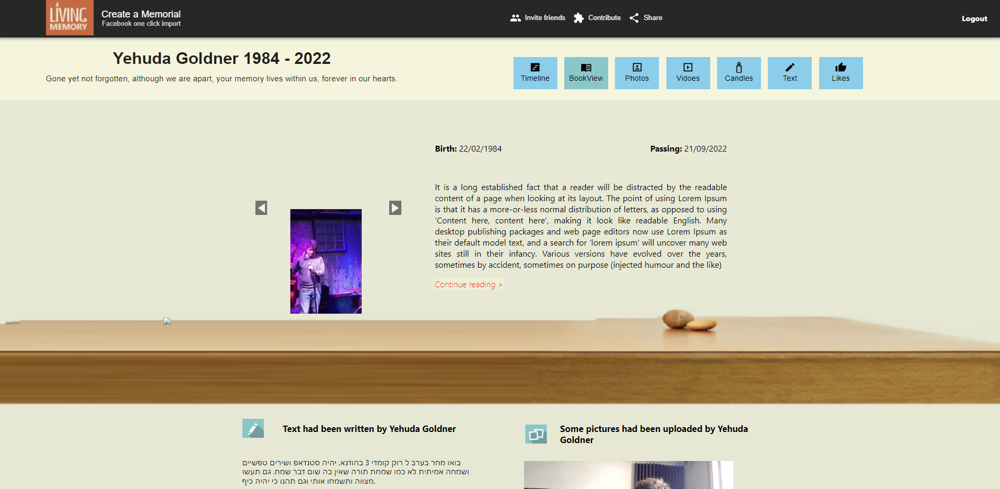

# 📖 Living Memory
#### A group final project. 
<b>"Living Memory"</b> is a platform for creating memorial pages using Facebook's API. 
We build this website in a group of three, my main part was the Front-End - 
Home page (Displaying real data from Facebook's api and from backend, and the style and responsivness of the page) & "add a candle" form connected to the backend.
 

## Website Link :point_down:
[Living Memory website](https://living-memory.xyz:8443/10158842065863652/)  

###### Already sets on one of our teammates facebook's data for the demo 

## Main Technologies:
- React - Functional components, context, link, route and Hooks
- Facebook's API
- Prisma for backend
- CSS
- Bootstrap
- Material UI
- Moment package for React

## Spoilers:
  

